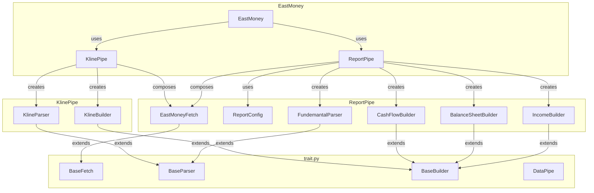

# EastMoney Refactoring Plan

## Issues Identified

### 1. Monolithic EastMoney Class
The `EastMoney` class contains multiple methods with significant code duplication:
- `quarterly_income()` (lines 352-407)
- `quarterly_balance_sheet()` (lines 409-468)
- `quarterly_cashflow()` (lines 470-529)
- `stock_hist()` (lines 531-595)

### 2. Bugs in Current Code
- **Line 439, 453, 500**: `self._url` is used but never defined in `__init__`
- **Line 442, 457, 503**: `self._parser` is used but never defined in `__init__`

### 3. Inconsistencies
- `quarterly_income()` uses `builder.normalize(df)` (line 406)
- `quarterly_balance_sheet()` and `quarterly_cashflow()` call individual builder methods (`rename()`, `convert_types()`, `reorder()`)
- `stock_hist()` also calls builder methods individually

### 4. Repetition
The quarterly methods share almost identical logic:
1. Build date from year and quarter
2. Build params with report name
3. Fetch initial page
4. Parse and get total pages
5. Fetch remaining pages concurrently
6. Build DataFrame

### 5. Unused Infrastructure
The `DataPipe` class from `trait.py` exists but is not being used in `eastmoney.py`

## Refactoring Strategy

### Architecture Overview



### Key Changes

#### 1. Create ReportConfig Dataclass
A configuration class to hold report-specific settings:

```python
@dataclass
class ReportConfig:
    """Configuration for quarterly financial reports."""

    report_name: str  # e.g., "RPT_DMSK_FN_INCOME"
    parser_class: type[BaseParser]
    builder_class: type[BaseBuilder]
    url: str = EAST_MONEY_API_URL
```

#### 2. Create ReportPipe Class
A specialized pipe for quarterly reports that handles the common pattern:

```python
class ReportPipe:
    """Pipe for fetching quarterly financial reports."""

    def __init__(self, fetcher: EastMoneyFetch, config: ReportConfig):
        self._fetcher = fetcher
        self._config = config

    def fetch(self, year: int, quarter: int) -> pl.DataFrame:
        """Fetch quarterly report data."""
        # Build params
        # Fetch initial page
        # Fetch remaining pages
        # Parse and build DataFrame
```

#### 3. Create KlinePipe Class
A specialized pipe for stock historical data:

```python
class KlinePipe:
    """Pipe for fetching stock kline data."""

    def __init__(self, fetcher: EastMoneyFetch):
        self._fetcher = fetcher

    def fetch(
        self,
        symbol: str,
        period: str,
        start_date: str,
        end_date: str,
        adjust: str,
    ) -> pl.DataFrame:
        """Fetch stock historical data."""
```

#### 4. Simplify EastMoney Class
The main class becomes a facade that delegates to specialized pipes:

```python
class EastMoney:
    """Main interface for East Money data."""

    def __init__(
        self,
        delay_range: tuple[float, float] = (0.5, 1.5),
        max_retries: int = 3,
        max_workers: int = 3,
    ):
        self._fetcher = EastMoneyFetch(
            delay_range=delay_range,
            max_retries=max_retries,
            max_workers=max_workers,
        )
        # Create report configurations
        self._income_config = ReportConfig(
            report_name="RPT_DMSK_FN_INCOME",
            parser_class=FundemantalParser,
            builder_class=IncomeBuilder,
        )
        self._balance_config = ReportConfig(
            report_name="RPT_DMSK_FN_BALANCE",
            parser_class=FundemantalParser,
            builder_class=BalanceSheetBuilder,
        )
        self._cashflow_config = ReportConfig(
            report_name="RPT_DMSK_FN_CASHFLOW",
            parser_class=FundemantalParser,
            builder_class=CashFlowBuilder,
        )

    def quarterly_income(self, year: int, quarter: int) -> pl.DataFrame:
        """Fetch quarterly income statement data."""
        pipe = ReportPipe(self._fetcher, self._income_config)
        return pipe.fetch(year, quarter)

    def quarterly_balance_sheet(self, year: int, quarter: int) -> pl.DataFrame:
        """Fetch quarterly balance sheet data."""
        pipe = ReportPipe(self._fetcher, self._balance_config)
        return pipe.fetch(year, quarter)

    def quarterly_cashflow(self, year: int, quarter: int) -> pl.DataFrame:
        """Fetch quarterly cash flow statement data."""
        pipe = ReportPipe(self._fetcher, self._cashflow_config)
        return pipe.fetch(year, quarter)

    def stock_hist(
        self,
        symbol: str = "000001",
        period: str = "daily",
        start_date: str = "19700101",
        end_date: str = "20500101",
        adjust: str = "",
    ) -> pl.DataFrame:
        """Fetch stock historical data (kline)."""
        pipe = KlinePipe(self._fetcher)
        return pipe.fetch(symbol, period, start_date, end_date, adjust)
```

#### 5. Extract Common Helper Methods
Create helper methods to reduce duplication:

```python
def _build_quarterly_date(year: int, quarter: int) -> str:
    """Build formatted date string from year and quarter."""
    quarter_end_months = {1: "03-31", 2: "06-30", 3: "09-30", 4: "12-31"}
    return f"{year}-{quarter_end_months[quarter][:2]}-{quarter_end_months[quarter][2:]}"

def _build_quarterly_params(
    report_name: str,
    formatted_date: str,
) -> dict:
    """Build params for quarterly report API."""
    return {
        "sortColumns": "NOTICE_DATE,SECURITY_CODE",
        "sortTypes": "-1,-1",
        "pageSize": "500",
        "pageNumber": "1",
        "reportName": report_name,
        "columns": "ALL",
        "filter": f"""(SECURITY_TYPE_CODE in ("058001001","058001008"))(TRADE_MARKET_CODE!="069001017")(REPORT_DATE='{formatted_date}')""",
    }
```

## File Structure After Refactoring

```
src/quant_trade/client/
├── eastmoney.py          # Main file with refactored code
└── trait.py              # Base classes (unchanged)

tests/
└── test_client_eastmoney.py  # Updated tests
```

## Test Updates Required

### New Test Classes
1. `TestReportConfig` - Test configuration dataclass
2. `TestReportPipe` - Test report pipe functionality
3. `TestKlinePipe` - Test kline pipe functionality
4. `TestHelperFunctions` - Test helper functions

### Updated Test Classes
1. `TestEastMoney` - Update to test the simplified facade methods
2. `TestEastMoneyStockHist` - Update to test through KlinePipe

### Test Coverage
- Unit tests for each pipe class
- Integration tests for EastMoney facade
- Tests for helper functions
- Backward compatibility tests remain unchanged

## Benefits of Refactoring

1. **Reduced Duplication**: Common patterns extracted into reusable components
2. **Fixed Bugs**: References to undefined `self._url` and `self._parser` removed
3. **Consistent API**: All methods use `builder.normalize()` consistently
4. **Better Separation of Concerns**: Each pipe class has a single responsibility
5. **Easier Testing**: Smaller, focused classes are easier to test
6. **Maintainability**: Changes to report fetching logic only need to be made in one place
7. **Extensibility**: Adding new report types only requires creating a new config

## Migration Path

1. Create new classes (`ReportConfig`, `ReportPipe`, `KlinePipe`)
2. Update `EastMoney` class to use the new pipes
3. Update tests to match new structure
4. Verify backward compatibility functions still work
5. Remove old duplicated code

## Backward Compatibility

All existing public APIs remain unchanged:
- `EastMoney.quarterly_income()`
- `EastMoney.quarterly_balance_sheet()`
- `EastMoney.quarterly_cashflow()`
- `EastMoney.stock_hist()`
- `stock_lrb_em()`
- `stock_zcfz_em()`
- `stock_xjll_em()`
- `stock_zh_a_hist()`
