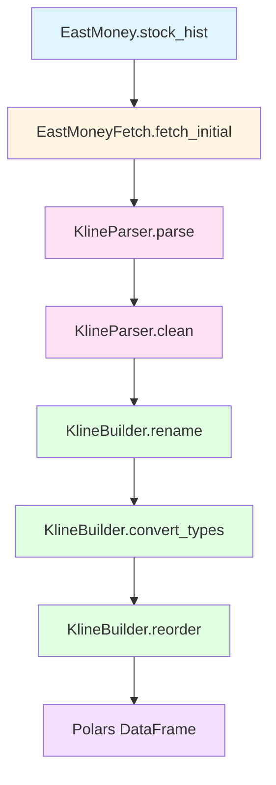

# Stock Historical Data Migration Plan

## Overview
Migrate the `stock_zh_a_hist` function from akshare into the existing `eastmoney.py` architecture following the Fetcher-Parser-Builder pattern.

## Analysis

### Original Function (`stock_zh_a_hist`)
- **API Endpoint**: `https://push2his.eastmoney.com/api/qt/stock/kline/get`
- **Parameters**:
  - `symbol`: Stock code (e.g., "000001")
  - `period`: "daily", "weekly", or "monthly"
  - `start_date`: Start date in "YYYYMMDD" format
  - `end_date`: End date in "YYYYMMDD" format
  - `adjust`: "" (no adjustment), "qfq" (forward adjustment), "hfq" (backward adjustment)
  - `timeout`: Optional timeout value
- **Response Structure**:
  ```json
  {
    "data": {
      "klines": [
        "2024-01-01,10.5,10.8,11.0,10.3,1000000,10800000,6.67,2.86,0.30,0.5"
      ]
    }
  }
  ```
- **Output Columns**: 日期, 股票代码, 开盘, 收盘, 最高, 最低, 成交量, 成交额, 振幅, 涨跌幅, 涨跌额, 换手率

### Existing Architecture
- `EastMoneyFetch`: Handles HTTP fetching with rate limiting
- `EastMoneyParser`: Parses JSON responses (uses `DATA_PATH = ("result", "data")`)
- `IncomeBuilder`, `BalanceSheetBuilder`, `CashFlowBuilder`: Build DataFrames using ColumnSpec pattern
- `EastMoney`: Main class composing all components

## Migration Plan

### 1. Create KlineParser Class
**Location**: After `EastMoneyParser` class (around line 107)

**Purpose**: Parse kline data from the different API endpoint structure

**Key Differences from EastMoneyParser**:
- Different `DATA_PATH`: `("data", "klines")` instead of `("result", "data")`
- Data format: Comma-separated strings instead of list of dicts
- Need to split strings and convert to structured format

**Implementation**:
```python
class KlineParser(BaseParser):
    """
    Parser for stock kline (historical) data.
    
    DATA_PATH configured for kline API response structure.
    Data is returned as comma-separated strings that need parsing.
    """
    
    DATA_PATH = ("data", "klines")
    
    def parse(self, raw: dict) -> list[dict]:
        """
        Parse kline response and extract data list.
        
        Args:
            raw: Raw JSON response dictionary
            
        Returns:
            List of data dictionaries
        """
        if not raw.get("data"):
            return []
        
        klines = raw.get("data", {}).get("klines", [])
        if not klines:
            return []
        
        # Parse comma-separated strings into dictionaries
        column_names = [
            "date", "open", "close", "high", "low",
            "volume", "amount", "amplitude", "change_pct",
            "change_amt", "turnover"
        ]
        
        data = []
        for kline in klines:
            values = kline.split(",")
            if len(values) == len(column_names):
                data.append(dict(zip(column_names, values)))
        
        return data
```

### 2. Create KlineBuilder Class
**Location**: After `CashFlowBuilder` class (around line 241)

**Purpose**: Build kline DataFrame with proper column names and types

**Implementation**:
```python
class KlineBuilder(BaseBuilder):
    """
    Builder for stock kline (historical) data.
    Uses ColumnSpec pattern for flexible column definitions.
    """
    
    COLUMN_SPECS = [
        ColumnSpec("date", "date"),
        ColumnSpec("open", "open", pl.Float64),
        ColumnSpec("close", "close", pl.Float64),
        ColumnSpec("high", "high", pl.Float64),
        ColumnSpec("low", "low", pl.Float64),
        ColumnSpec("volume", "volume", pl.Float64),
        ColumnSpec("amount", "amount", pl.Float64),
        ColumnSpec("amplitude", "amplitude", pl.Float64),
        ColumnSpec("change_pct", "change_pct", pl.Float64),
        ColumnSpec("change_amt", "change_amt", pl.Float64),
        ColumnSpec("turnover", "turnover", pl.Float64),
    ]
    
    OUTPUT_ORDER = [
        "date",
        "stock_code",
        "open",
        "close",
        "high",
        "low",
        "volume",
        "amount",
        "amplitude",
        "change_pct",
        "change_amt",
        "turnover",
    ]
    
    DATE_COL = "date"
    DUPLICATE_COLS = ("stock_code", "date")
```

### 3. Add stock_hist Method to EastMoney Class
**Location**: After `quarterly_cashflow` method (around line 459)

**Purpose**: Fetch stock historical data using the kline API

**Implementation**:
```python
def stock_hist(
    self,
    symbol: str = "000001",
    period: str = "daily",
    start_date: str = "19700101",
    end_date: str = "20500101",
    adjust: str = "",
) -> pl.DataFrame:
    """
    Fetch stock historical data (kline).
    
    Args:
        symbol: Stock code (e.g., "000001")
        period: "daily", "weekly", or "monthly"
        start_date: Start date in "YYYYMMDD" format
        end_date: End date in "YYYYMMDD" format
        adjust: "" (no adjustment), "qfq" (forward), "hfq" (backward)
    
    Returns:
        Polars DataFrame with historical stock data
    """
    # Determine market code
    market_code = 1 if symbol.startswith("6") else 0
    
    # Build parameter mappings
    adjust_dict = {"qfq": "1", "hfq": "2", "": "0"}
    period_dict = {"daily": "101", "weekly": "102", "monthly": "103"}
    
    # Build params
    params = {
        "fields1": "f1,f2,f3,f4,f5,f6",
        "fields2": "f51,f52,f53,f54,f55,f56,f57,f58,f59,f60,f61,f116",
        "ut": "7eea3edcaed734bea9cbfc24409ed989",
        "klt": period_dict[period],
        "fqt": adjust_dict[adjust],
        "secid": f"{market_code}.{symbol}",
        "beg": start_date,
        "end": end_date,
    }
    
    # Use kline API endpoint
    url = "https://push2his.eastmoney.com/api/qt/stock/kline/get"
    
    # Fetch data
    raw = self._fetcher.fetch_initial(url, params)
    
    # Parse using KlineParser
    parser = KlineParser()
    data = parser.parse(raw)
    if not data:
        return pl.DataFrame()
    
    # Build DataFrame
    df = parser.clean(data)
    
    # Add stock_code column
    df = df.with_columns(pl.lit(symbol).alias("stock_code"))
    
    # Apply builder transformations
    builder = KlineBuilder()
    df = builder.rename(df)
    df = builder.convert_types(df)
    df = builder.reorder(df)
    
    return df
```

### 4. Add Backward-Compatible Function
**Location**: After existing backward-compatible functions (around line 598)

**Purpose**: Provide backward compatibility with original akshare function signature

**Implementation**:
```python
def stock_zh_a_hist(
    symbol: str = "000001",
    period: str = "daily",
    start_date: str = "19700101",
    end_date: str = "20500101",
    adjust: str = "",
    timeout: float = None,
    **kwargs
) -> pl.DataFrame:
    """
    East Money Stock Historical Data (Backward Compatible).
    
    Args:
        symbol: Stock code (e.g., "000001")
        period: "daily", "weekly", or "monthly"
        start_date: Start date in "YYYYMMDD" format
        end_date: End date in "YYYYMMDD" format
        adjust: "" (no adjustment), "qfq" (forward), "hfq" (backward)
        timeout: Timeout value (not used, kept for compatibility)
        **kwargs: Additional arguments (max_workers, delay_range)
    
    Returns:
        Polars DataFrame with historical stock data
    """
    # Extract kwargs
    max_workers = kwargs.get("max_workers", 3)
    delay_range = kwargs.get("delay_range", (0.5, 1.5))
    
    # Use context manager
    with EastMoney(
        delay_range=delay_range,
        max_workers=max_workers,
    ) as client:
        return client.stock_hist(
            symbol=symbol,
            period=period,
            start_date=start_date,
            end_date=end_date,
            adjust=adjust,
        )
```

## Architecture Diagram



## Key Design Decisions

1. **Separate Parser**: Created `KlineParser` because the kline API has a different response structure (comma-separated strings) compared to the financial reports API (list of dicts).

2. **Separate Builder**: Created `KlineBuilder` with column specifications matching the kline data structure.

3. **No Pagination**: The kline API returns all data in a single response, so no concurrent page fetching is needed.

4. **Date Format**: The kline API uses "YYYYMMDD" format for dates, which is preserved in the interface.

5. **Column Names**: Used English column names internally (open, close, etc.) for consistency with the existing codebase.

## Testing Checklist

- [ ] Test fetching daily data for a single stock
- [ ] Test fetching weekly data
- [ ] Test fetching monthly data
- [ ] Test with forward adjustment (qfq)
- [ ] Test with backward adjustment (hfq)
- [ ] Test with no adjustment
- [ ] Test date range filtering
- [ ] Test backward-compatible function
- [ ] Verify column names and data types
- [ ] Verify date parsing

## Files to Modify

1. `src/quant_trade/client/eastmoney.py` - Add KlineParser, KlineBuilder, stock_hist method, and stock_zh_a_hist function
