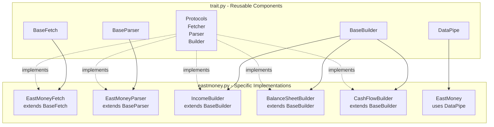

# Trait Extraction Plan - Generalizing EastMoney Patterns

## Objective
Extract reusable patterns from `eastmoney.py` into `trait.py` to create a generic data pipe architecture that can be reused across different data providers.

---

## Phase 1: Protocol Definitions (trait.py)

### Protocols to Extract

```python
# src/quant_trade/client/trait.py

from collections.abc import Callable
from concurrent.futures import ThreadPoolExecutor, as_completed
from dataclasses import dataclass
from typing import Any

import polars as pl
import requests
from requests.adapters import HTTPAdapter
from urllib3.util.retry import Retry


# =============================================================================
# Protocols - Duck Typing Interfaces
# =============================================================================

class Fetcher(Callable):
    """
    Protocol for fetching - duck typing interface.
    
    Implementations must provide:
    - fetch_initial(url, params) -> dict
    - fetch_page(url, params, page) -> dict
    - close() -> None
    """
    
    def fetch_initial(self, url: str, params: dict) -> dict: ...
    def fetch_page(self, url: str, params: dict, page: int) -> dict: ...
    def close(self) -> None: ...


class Parser(Callable):
    """
    Protocol for parsing.
    
    Implementations must provide:
    - parse(raw) -> list[dict]
    - clean(data) -> pl.DataFrame
    """
    
    def parse(self, raw: dict) -> list[dict]: ...
    def clean(self, data: list[dict]) -> pl.DataFrame: ...


class Builder(Callable):
    """
    Protocol for building output.
    
    Implementations must provide:
    - rename(df) -> pl.DataFrame
    - convert_types(df) -> pl.DataFrame
    - reorder(df) -> pl.DataFrame
    """
    
    def rename(self, df: pl.DataFrame) -> pl.DataFrame: ...
    def convert_types(self, df: pl.DataFrame) -> pl.DataFrame: ...
    def reorder(self, df: pl.DataFrame) -> pl.DataFrame: ...
```

---

## Phase 2: Base Implementations (trait.py)

### BaseFetcher - Reusable HTTP Fetching with Anti-Blocking

```python
class BaseFetch:
    """
    Base Fetcher with anti-blocking features.
    
    Anti-blocking features:
    - Randomized delays between requests
    - User-Agent rotation
    - Session pooling with retry strategy
    - Concurrent fetching with ThreadPoolExecutor
    
    Usage:
        class MyFetcher(BaseFetch):
            def fetch_initial(self, url: str, params: dict) -> dict:
                # Custom implementation
                pass
            
            def fetch_page(self, url: str, params: dict, page: int) -> dict:
                # Custom implementation
                pass
    """
    
    # User agents for rotation - can be overridden
    USER_AGENTS: list[str] = [
        "Mozilla/5.0 (Windows NT 10.0; Win64; x64) AppleWebKit/537.36",
        "Mozilla/5.0 (Macintosh; Intel Mac OS X 10_15_7) AppleWebKit/537.36",
        "Mozilla/5.0 (Windows NT 10.0; Win64; x64; rv:120.0) Gecko/2010",
    ]
    
    def __init__(
        self,
        delay_range: tuple[float, float] = (0.5, 1.5),
        max_retries: int = 3,
        max_workers: int = 3,
    ):
        self.delay_range = delay_range
        self.max_retries = max_retries
        self.max_workers = max_workers
        self._session = self._create_session()
    
    def _create_session(self) -> requests.Session:
        """Create session with connection pooling and retry strategy."""
        session = requests.Session()
        retry_strategy = Retry(
            total=self.max_retries,
            backoff_factor=1,
            status_forcelist=[429, 500, 502, 503, 504],
            allowed_methods=["GET"],
        )
        adapter = HTTPAdapter(
            pool_connections=10,
            pool_maxsize=20,
            max_retries=retry_strategy,
        )
        session.mount("http://", adapter)
        session.mount("https://", adapter)
        return session
    
    def _get_headers(self) -> dict:
        """Generate headers with random user agent."""
        import random
        return {
            "User-Agent": random.choice(self.USER_AGENTS),
            "Accept": "application/json, text/plain, */*",
            "Accept-Encoding": "gzip, deflate, br",
            "Accept-Language": "zh-CN,zh;q=0.9,en;q=0.8",
            "Connection": "keep-alive",
        }
    
    def _rate_limit(self) -> None:
        """Apply random delay to mimic human behavior."""
        import random
        import time
        time.sleep(random.uniform(*self.delay_range))
    
    def fetch_initial(self, url: str, params: dict) -> dict:
        """Fetch initial page - override in subclass."""
        raise NotImplementedError
    
    def fetch_page(self, url: str, params: dict, page: int) -> dict:
        """Fetch single page - override in subclass."""
        raise NotImplementedError
    
    def fetch_pages_concurrent(
        self,
        url: str,
        params: dict,
        pages: list[int],
    ) -> list[dict]:
        """Fetch multiple pages concurrently."""
        import random
        results = []
        
        with ThreadPoolExecutor(max_workers=self.max_workers) as executor:
            future_to_page = {
                executor.submit(self.fetch_page, url, params, page): page
                for page in pages
            }
            
            for future in as_completed(future_to_page):
                try:
                    result = future.result()
                    results.append(result)
                except Exception as e:
                    page = future_to_page[future]
                    print(f"Error fetching page {page}: {e}")
        
        return results
    
    def close(self) -> None:
        """Close the session."""
        self._session.close()
```

### BaseParser - Generic JSON Parsing

```python
class BaseParser:
    """
    Base Parser - converts raw JSON to structured data.
    
    Override these methods:
    - get_data_path: tuple of keys to extract data list from response
    - get_page_info: function to extract page info from response
    - clean_data: custom cleaning logic
    """
    
    # Keys to traverse to get data list, e.g., ("result", "data")
    DATA_PATH: tuple[str, ...] = ("result", "data")
    
    # Key for total pages, default "pages"
    PAGES_KEY: str = "pages"
    
    def parse(self, raw: dict) -> list[dict]:
        """Parse response and extract data list."""
        if not raw.get("result"):
            return []
        
        # Navigate to data using DATA_PATH
        data = raw
        for key in self.DATA_PATH:
            data = data.get(key, {})
            if data is None:
                return []
        
        return data if isinstance(data, list) else []
    
    def get_total_pages(self, raw: dict) -> int:
        """Get total pages from response."""
        return raw.get("result", {}).get(self.PAGES_KEY, 1)
    
    def clean(self, data: list[dict]) -> pl.DataFrame:
        """Clean and convert to Polars DataFrame."""
        if not data:
            return pl.DataFrame()
        
        df = pl.DataFrame(data)
        
        # Optional: Remove duplicates - override for specific cases
        return df
```

### BaseBuilder - Generic DataFrame Building

```python
@dataclass
class ColumnSpec:
    """Specification for a column transformation."""
    source: str  # Original column name
    target: str  # Target column name
    dtype: pl.DataType | None = None  # Target dtype


class BaseBuilder:
    """
    Base Builder - generic DataFrame transformation.
    
    Subclass must set:
    - COLUMN_SPECS: list[ColumnSpec] - column specifications
    - OUTPUT_ORDER: list[str] - final column order
    - DATE_COL: str | None = name of date column if exists
    
    Usage:
        class MyBuilder(BaseBuilder):
            COLUMN_SPECS = [
                ColumnSpec("SECURITY_CODE", "stock_code"),
                ColumnSpec("NOTICE_DATE", "notice_date", pl.Date),
                ColumnSpec("NETPROFIT", "net_profit", pl.Float64),
            ]
            
            OUTPUT_ORDER = ["seq", "stock_code", "stock_name", "notice_date"]
            DATE_COL = "notice_date"
    """
    
    COLUMN_SPECS: list[ColumnSpec] = None  # type: ignore
    OUTPUT_ORDER: list[str] = None  # type: ignore
    DATE_COL: str | None = None
    DUPLICATE_COLS: tuple[str, ...] = None  # Columns for deduplication
    
    def __post_init__(self):
        if self.COLUMN_SPECS is None:
            self.COLUMN_SPECS = []
        if self.OUTPUT_ORDER is None:
            self.OUTPUT_ORDER = []
    
    @property
    def COLUMN_MAPPING(self) -> dict[str, str]:
        """Generate column mapping from specs."""
        return {spec.source: spec.target for spec in self.COLUMN_SPECS}
    
    @property
    def NUMERIC_COLS(self) -> list[str]:
        """Get numeric columns."""
        return [
            spec.target for spec in self.COLUMN_SPECS
            if spec.dtype in (pl.Float64, pl.Float32, pl.Int64, pl.Int32)
        ]
    
    def rename(self, df: pl.DataFrame) -> pl.DataFrame:
        """Apply column renaming."""
        rename_map = {
            k: v for k, v in self.COLUMN_MAPPING.items()
            if k in df.columns
        }
        return df.rename(rename_map)
    
    def convert_types(self, df: pl.DataFrame) -> pl.DataFrame:
        """Convert column types."""
        result = df
        
        # Convert numeric columns
        for col in self.NUMERIC_COLS:
            if col in result.columns:
                result = result.with_columns(
                    pl.col(col).cast(pl.Float64, strict=False)
                )
        
        # Convert date column
        if self.DATE_COL and self.DATE_COL in result.columns:
            result = result.with_columns(
                pl.col(self.DATE_COL).str.to_date(strict=False)
            )
        
        return result
    
    def reorder(self, df: pl.DataFrame) -> pl.DataFrame:
        """Reorder columns and add sequence."""
        # Select only columns that exist
        available = [c for c in self.OUTPUT_ORDER if c in df.columns]
        
        # Add sequence column at position 0
        if df.height > 0:
            result = df.select(available).with_columns(
                pl.arange(1, df.height + 1).alias("seq")
            )
        else:
            result = df.select(available)
        
        # Reorder to match output columns
        ordered = [c for c in self.OUTPUT_ORDER if c in result.columns]
        return result.select(ordered)
```

---

## Phase 3: Data Pipe Infrastructure (trait.py)

### DataPipe - Orchestrates Fetcher -> Parser -> Builder

```python
class DataPipe:
    """
    Generic data pipe that orchestrates Fetcher -> Parser -> Builder.
    
    This is the core abstraction that enables reusable data fetching patterns.
    
    Usage:
        pipe = DataPipe(
            fetcher=my_fetcher,
            parser=my_parser,
            builder=my_builder,
        )
        df = pipe.run(url, params)
    """
    
    def __init__(
        self,
        fetcher: Fetcher,
        parser: Parser,
        builder: Builder,
    ):
        self.fetcher = fetcher
        self.parser = parser
        self.builder = builder
    
    def run(
        self,
        url: str,
        params: dict,
        concurrent_pages: bool = True,
    ) -> pl.DataFrame:
        """
        Execute the full data pipeline.
        
        Args:
            url: API endpoint URL
            params: Query parameters
            concurrent_pages: Whether to fetch pages concurrently
        
        Returns:
            Transformed Polars DataFrame
        """
        # Fetch initial page
        raw = self.fetcher.fetch_initial(url, params)
        
        # Parse and get total pages
        data = self.parser.parse(raw)
        if not data:
            return pl.DataFrame()
        
        total_pages = self._get_total_pages(raw)
        
        # Fetch remaining pages concurrently
        if concurrent_pages and total_pages > 1:
            pages_to_fetch = list(range(2, total_pages + 1))
            page_results = self.fetcher.fetch_pages_concurrent(
                url, params, pages_to_fetch
            )
            
            for page_raw in page_results:
                page_data = self.parser.parse(page_raw)
                data.extend(page_data)
        
        # Build DataFrame
        df = self.parser.clean(data)
        
        # Apply builder transformations
        df = self.builder.rename(df)
        df = self.builder.convert_types(df)
        df = self.builder.reorder(df)
        
        return df
    
    def _get_total_pages(self, raw: dict) -> int:
        """Extract total pages - can be overridden."""
        return raw.get("result", {}).get("pages", 1)
    
    def __enter__(self) -> "DataPipe":
        return self
    
    def __exit__(self, *args) -> None:
        self.fetcher.close()
```

---

## Phase 4: Updated eastmoney.py Structure

After extraction, `eastmoney.py` will:

```python
# src/quant_trade/client/eastmoney.py

from .trait import (
    Fetcher, Parser, Builder,
    BaseFetch, BaseParser, BaseBuilder,
    DataPipe,
)

# Keep EastMoney-specific implementations here
class EastMoneyFetch(BaseFetch):
    """EastMoney-specific fetching with custom params handling."""
    
    def fetch_initial(self, url: str, params: dict) -> dict:
        # EastMoney-specific implementation
        pass
    
    def fetch_page(self, url: str, params: dict, page: int) -> dict:
        # EastMoney-specific implementation
        pass


class EastMoneyParser(BaseParser):
    """EastMoney-specific parsing."""
    
    DATA_PATH = ("result", "data")


class IncomeBuilder(BaseBuilder):
    """Income statement builder - uses BaseBuilder infrastructure."""
    
    COLUMN_SPECS = [
        ColumnSpec("SECURITY_CODE", "stock_code"),
        ColumnSpec("SECURITY_NAME_ABBR", "stock_name"),
        ColumnSpec("NOTICE_DATE", "notice_date", pl.Date),
        ColumnSpec("NETPROFIT", "net_profit", pl.Float64),
        # ... more specs
    ]
    
    OUTPUT_ORDER = ["seq", "stock_code", "stock_name", "net_profit", "notice_date"]
    DATE_COL = "notice_date"


class EastMoney:
    """Main interface - uses DataPipe internally."""
    
    def __init__(self):
        self._fetcher = EastMoneyFetch()
        self._parser = EastMoneyParser()
        self._builder = IncomeBuilder()
        self._pipe = DataPipe(self._fetcher, self._parser, self._builder)
    
    def quarterly_income(self, year: int, quarter: int) -> pl.DataFrame:
        # Build params
        params = {...}
        
        # Use data pipe
        return self._pipe.run(self._url, params)
```

---

## Benefits of This Architecture

1. **Reusability**: Base classes can be reused for other data providers
2. **Testability**: Each component can be tested independently
3. **Composability**: DataPipe provides plug-and-play orchestration
4. **Extensibility**: Easy to add new providers by subclassing base classes
5. **Consistency**: All data providers follow the same pattern

---

## Files to Modify

| File | Changes |
|------|---------|
| `src/quant_trade/client/trait.py` | Create with protocols, base classes, DataPipe |
| `src/quant_trade/client/eastmoney.py` | Refactor to use trait.py components |

---

## Mermaid Diagram - Architecture


